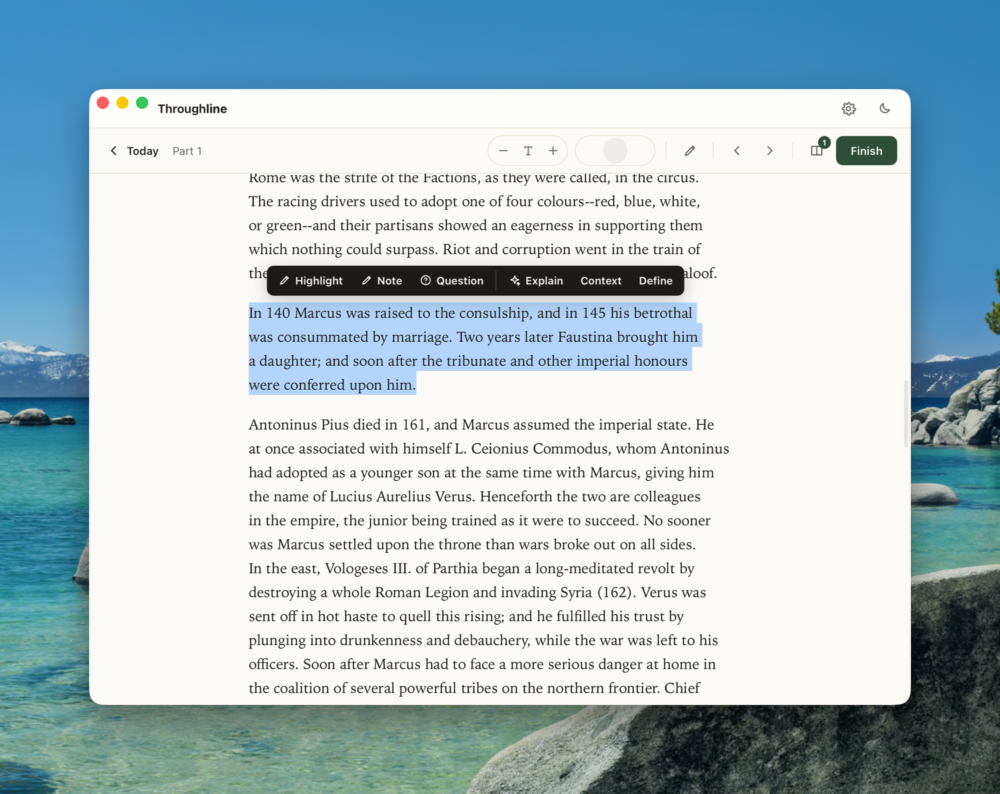
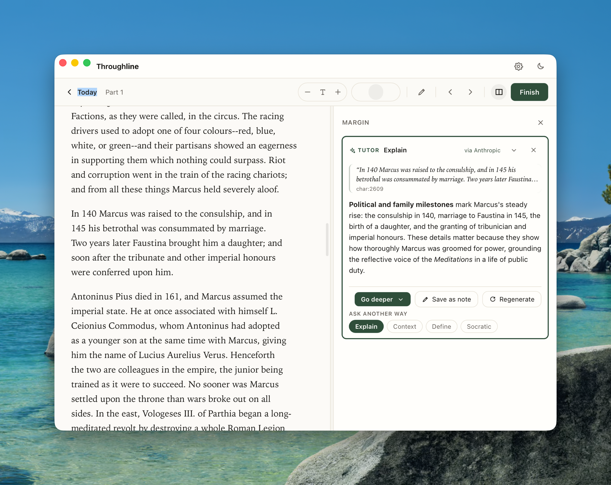

# Throughline

[](https://github.com/nferna26/throughline/actions/workflows/ci.yml)
[](./LICENSE)


Local-first macOS reading app for one serious reader. Import a DRM-free book, see exactly what to read today, complete a 15–30 minute session, capture one useful note, and export safe Markdown into a GBrain-style knowledgebase.

The binding contract is [CLAUDE.md](./CLAUDE.md). The full spec is [docs/PRD.md](./docs/PRD.md). The IPC surface is [docs/IPC.md](./docs/IPC.md).

## Screenshots

<!-- Drop PNGs into docs/screenshots/ and they'll render here.
     Suggested shots: Today screen, the reader, the AI tutor panel mid-stream, Settings. -->

| Today | Reader | AI Tutor |
| --- | --- | --- |
|  |  |  |

> Screenshots not committed yet — drop them into `docs/screenshots/` to populate this table.

## Platform support

**macOS only.** Data paths are macOS-specific (`~/Library/Application Support/Throughline/`). Tauri can compile for Linux and Windows, but those paths would need to move to `dirs::data_dir()` first — see [issue tracker](https://github.com/nferna26/throughline/issues) if you want to help.

## Scope

The whole loop end to end, every part offline:

1. Import one plain-text or DRM-free EPUB book (immutable copy + SHA-256).
2. Generate a 30-day reading plan (front matter automatically skipped for EPUBs).
3. Open to **Today** — see today's section, monthly progress, pace state, gentle streak.
4. Read in a calm reader. One session per sitting, Next ›/‹ Prev between sections, Finish session.
5. Capture notes with tagged locators (`char:` / `cfi:`); short-quote warning above ~300 characters.
6. Optional: AI **tutor prompt-preview** stubs against a text selection. **No remote call ever.**
7. Export safe Markdown to `~/GBrain/Reading/`.

If you fall behind, the Today screen surfaces shame-free recovery options (resume today, gentle catch-up, weekend window, extend finish date). There is deliberately no "restart current chapter" — throwing away read progress is a punishment, not a recovery.

## Non-goals (still hard)

- No remote AI calls. AI is prompt-preview only — generates the text that *would* be sent. Nothing is sent.
- No cloud sync, accounts, telemetry, background agents.
- No OpenClaw integration. Not even a stub.
- No mobile app, PDF/OCR, DRM handling.
- No quizzes, spaced repetition, XP, badges, mascots, leaderboards, confetti.
- No dashboard-first or library-first UX. The app opens to **Today**.

See [CLAUDE.md](./CLAUDE.md) for the full list.

## Tech

- Shell: Tauri v2
- Frontend: React 19 + TypeScript + Vite
- Backend: Rust commands (filesystem, hashing, SQLite, Markdown export, EPUB classifier, AI stubs)
- EPUB rendering: `epubjs` inside the Tauri webview (manager: default, flow: scrolled-doc)

## Local data paths

| What | Where |
| --- | --- |
| Operational DB | `~/Library/Application Support/Throughline/reading.db` |
| Imported book sources | `~/Library/Application Support/Throughline/books/{book_id}/source.txt` or `source.epub` (chmod 444) |
| Manifests | `~/Library/Application Support/Throughline/books/{book_id}/manifest.json` |
| Markdown exports | `~/GBrain/Reading/{Books,Sessions,Notes,Reviews,_indexes}/` (path overridable in Settings) |

Raw source files stay local. Exports contain locators, paraphrases, reflections, and short quotes only — never raw book text.

## Install & run

Prereqs: Node 20+, Rust + Cargo, Xcode Command Line Tools, macOS.

**Run from source (dev):**

```bash
git clone https://github.com/nferna26/throughline
cd throughline
npm install
npm run tauri dev
```

**Build a standalone app:**

```bash
npm run tauri build
# Produces an unsigned .app + .dmg under:
#   src-tauri/target/release/bundle/{macos,dmg}/
```

A local `npm run tauri build` is **unsigned** — on first open macOS Gatekeeper will warn (right-click → Open). Tagged releases (`git tag v*`) build a universal `.dmg` via GitHub Actions and **sign + notarize** it when the Apple signing secrets are configured, so the released `.dmg` opens cleanly on any Mac. Setup runbook: [docs/SIGNING.md](./docs/SIGNING.md).

**Optional — AI tutor:** runs against any local OpenAI-compatible server (LM Studio, llama.cpp, MLX) at `http://localhost:1234/v1`. The rest of the app works without it.

## Rollback — remove all app data

This deletes the DB, all imported source files, and the manifests. Markdown
exports in `~/GBrain/Reading/` are kept by default; remove them separately if
you want a clean slate.

```bash
# 1. Quit Throughline first (Cmd-Q in the app window).

# 2. Remove operational state + imported sources.
rm -rf "$HOME/Library/Application Support/Throughline"

# 3. (Optional) Remove exported Markdown.
rm -rf "$HOME/GBrain/Reading"

# 4. (Optional) Remove the repo itself.
rm -rf "$HOME/code/throughline"
```

The export path is configurable. If you've changed it in Settings, swap that location into step 3.

## Privacy posture

- Raw text and EPUB source files stay local. Never sent to any API.
- Every imported source has a SHA-256 hash stored in the DB.
- Exported notes carry `source_private: true` in frontmatter.
- Quote fields longer than ~300 characters trigger a non-blocking warning (fair use has no fixed safe word count; the default posture is short quotes for private study only).

## AI posture (Shot 4 — local-only ENFORCED)

- **Default Settings: `Local-only mode: ON`.** The AI client refuses any non-loopback URL while local-only is ON — `localhost`, `127.0.0.0/8`, and `::1` are accepted, everything else is rejected at the call site with a clear error. This is a code invariant, not a policy: see `ai_client::validate_base_url`.
- Selection-only context: the assembled prompt uses the user's text selection or their own notes. The book body is never included.
- **Preview == sent**: the bytes the user saw as a preview equal the bytes shipped as `messages[0].content`. Unit-tested across all six stub modes.
- Save-by-approval: AI responses are ephemeral. Saving a response as a note is opt-in per request and writes a real Note row + Markdown export. `ai_requests.wrote_to_memory` flips to `1` only on approval; the `provider` field stores the host that was actually contacted (e.g. `localhost:1234`).
- Turning local-only OFF requires an explicit confirm step in Settings. While OFF, the AI panel shows a red banner in the reader naming the URL that will receive your selection.
- The default target is LM Studio at `http://localhost:1234/v1`. Model id is free-form — type whatever you loaded.
- A unit test (`local_only_rejects_remote_and_allows_loopback`) pins the loopback invariant. A mock-HTTP integration test (`mock_server_streams_deltas_to_client`) verifies the exact OpenAI-shape POST + SSE streaming without needing a live MLX server.

## IPC contract

The frontend talks to the Rust backend through Tauri commands. The full surface — every command, args, return shape, error shape — is in [`docs/IPC.md`](./docs/IPC.md). Current API version is `1`. Read at runtime via `invoke("cmd_api_version")`.

Semver commitment: patch and minor versions are non-breaking; major bumps the `COMMAND_API_VERSION` constant and is called out in the README + CHANGELOG.

## Known limitations

- One book at a time (Shot 1 / Shot 2 / Shot 2.5 / Shot 3 scope). Re-importing requires the rollback steps above.
- Plain text books trim a Project-Gutenberg-style header/footer when detected; arbitrary plain text may include front matter.
- EPUB front/back-matter classification is heuristic: cover / title page / contents / copyright / acknowledgments / about-the-author / "also by" / about-the-publisher are skipped, everything else (including Prologue / Foreword / Preface / Notes) is kept. Edge-case books may need a re-import once classifier patterns expand.
- EPUB rendering uses the Tauri webview's iframe. Books with aggressive author CSS may show layout quirks despite the `!important` theme injection.
- Char-offset resume on text books is paragraph-accurate, not glyph-accurate. Notes always carry a precise `char:N` locator regardless.
- A local `npm run tauri build` is unsigned (Gatekeeper warns; right-click → Open). Tagged releases are signed + notarized via CI and open cleanly — see [docs/SIGNING.md](docs/SIGNING.md).

## 14-day experiment protocol

Goal of the experiment: prove the loop builds a serious reading habit, not just a working app.

**Each day**
1. Open the app before email/social. Today screen first.
2. Read for 20 minutes or until the assigned section is complete — whichever comes first.
3. Capture one note per session (any of Observation / Question / Connection / Reflection / Short Quote).
4. Use the AI tutor at most twice per day, only on selected text, only as prompt-preview. Save to note only if it earns its keep.
5. Finish session.

**At end of week**
- Read the exported Markdown in `~/GBrain/Reading/Notes/`. Anything generic gets deleted.

**Decision after 14 days — continue if all of:**
- At least 10 of 14 reading days.
- At least 250 total reading minutes.
- At least 8 notes worth keeping.
- Still on pace for the monthly book.
- AI acted as a tutor (prompt-preview), not a substitute.
- App development did not dominate reading time.

**Simplify or stop if any of:** fewer than 7 reading days, more coding than reading after setup, AI summaries replacing reading, notes feel generic, EPUB bugs dominate, scope creep toward Bible mode / nutrition / running / OpenClaw before the book is finished.
